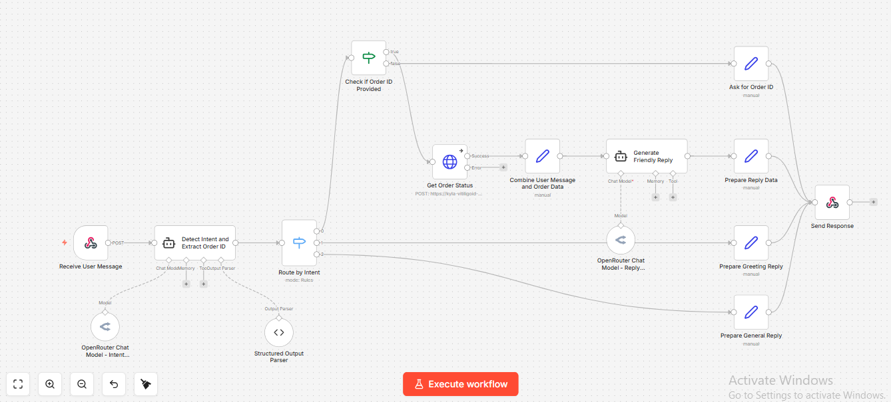

# AI-Powered Order Retrieval Agent

A sophisticated automation workflow that uses Large Language Models to interpret customer intent and fetch real-time order data via REST APIs.

## 🚀 Features
- **Intent Classification:** Detects if a user is greeting, asking for status, or seeking general help.
- **Entity Extraction:** Pulls Order IDs from natural language using regex-free AI extraction.
- **Validation Engine:** Automatically prompts users for missing information if an Order ID isn't detected.
- **Friendly Response Synthesis:** Converts raw JSON data from the backend into a polite, human-readable format.

## 🛠️ Tech Stack
- **Orchestration:** n8n
- **Models:** Llama 3.3 70B (Logic)
- **Data Handling:** LangChain Output Parsers
- **API:** Custom REST Endpoint (via ngrok)

## 📊 Workflow Visualization

## 📖 How it Works
1. User sends a message via Webhook.
2. AI identifies the "Intent".
3. If intent = `ORDER_STATUS`, it checks for an `Order_ID`.
4. If `Order_ID` is found, it calls the internal database API.
5. The result is formatted by a second AI agent and sent back to the user.
